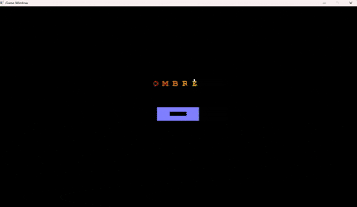

<h1 align="center">OMBRE</h1>

  A Fog of War Tank Battle Game built with C++ and graphics.h

# OMBRE – Fog of War Tank Battle

> *A tank battle game where every movement matters, and danger can emerge from the shadows at any moment.*

  

## 🎮 About the Project

**OMBRE** is a 2D tank battle game developed in **C++** using the **graphics.h** library. The game focuses on exploration, strategy, and limited battlefield awareness through a **Fog of War** system.

Unlike traditional tank games where every enemy is visible from the start, OMBRE hides enemy tanks within the darkness of the map. Players must carefully navigate the battlefield, search for enemies, and react quickly when threats suddenly appear within their line of sight.

The game encourages strategic decision-making by limiting the player's vision and rewarding successful engagements with increased map visibility.

---

## 🌫️ Gameplay Overview

At the beginning of the game, most of the map is covered by fog, preventing players from seeing enemy locations.

Your tank can only observe a limited area around its current position. Enemy tanks remain hidden until they move close enough to be detected, creating a constant sense of uncertainty and tension.

As you explore the battlefield, you must locate and eliminate enemy tanks while avoiding surprise attacks from unseen opponents.

---

## 🔥 Dynamic Vision System

One of OMBRE's main mechanics is its vision-based gameplay.

### Limited Visibility
- The player's tank has a restricted vision radius.
- Areas outside this radius remain hidden.
- Enemy tanks cannot be seen unless they enter the visible area.

### Enemy Encounters
- Enemy tanks patrol the map and actively attack the player.
- Encounters often happen unexpectedly due to the Fog of War system.
- Players must stay alert and adapt to changing battlefield conditions.

### Revealing the Battlefield
When an enemy tank is destroyed, it leaves behind a burning wreck that acts as a permanent vision source.

This means:
- The surrounding area becomes permanently revealed.
- Fog is removed around the destroyed tank.
- Players gain more information about nearby terrain and enemy movement.

As more enemies are eliminated, larger portions of the map become visible, gradually reducing uncertainty and giving players greater control of the battlefield.

---

## ✨ Features

- 🚀 Real-time tank combat
- 🌫️ Fog of War system
- 👀 Limited player vision
- 🤖 AI-controlled enemy tanks
- 🔥 Permanent map revelation after enemy destruction
- 🎯 Strategic exploration and positioning
- 💥 Projectile and collision mechanics
- 🗺️ Progressive map discovery

---

## 🎯 Objective

The objective of the game is to survive, explore the battlefield, and eliminate all enemy tanks.

Players must balance exploration and combat while using limited information to their advantage. Every destroyed enemy helps uncover more of the map, making each victory an important step toward complete battlefield control.

---

## 🛠️ Built With

- **C++**
- **graphics.h**
- Object-Oriented Programming (OOP)
- Custom Fog of War Logic
- Collision Detection System
- Basic Enemy AI

---

## 📖 Inspiration

OMBRE was designed around a simple idea:

> *What if a tank battle wasn't just about shooting enemies, but also about finding them?*

By combining classic tank combat with a Fog of War mechanic, the game creates a more immersive and strategic experience where information becomes just as important as firepower.

---

### Developed with C++ and graphics.h
